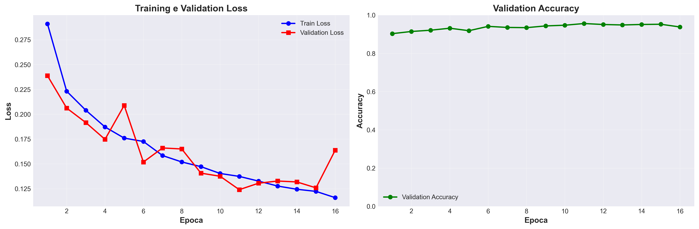
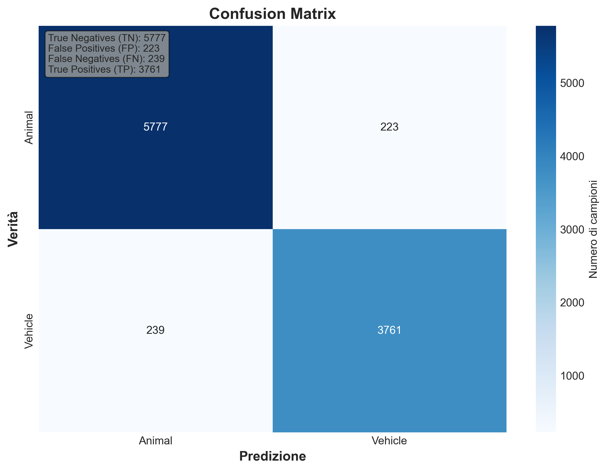

# VisionTech — Animal vs Vehicle Recognition

Computer Vision project based on **Convolutional Neural Networks (CNN)** for binary image classification: **Animal vs Vehicle**.

The goal is to simulate an **urban monitoring system** capable of automatically detecting animals or vehicles from camera feeds, supporting applications such as **road safety monitoring and accident prevention**.

---

# Project Overview

This project implements a complete deep learning pipeline for image classification using **PyTorch**.

The system is designed to:

- Classify images into two categories:
  - **Animal (0)** – animals potentially crossing roads
  - **Vehicle (1)** – vehicles in traffic
- Demonstrate how CNN-based systems can support **urban monitoring scenarios**
- Provide a reproducible ML pipeline including:
  - training
  - evaluation
  - error analysis
  - inference on new images

An optional **Streamlit interface** allows interactive testing of the trained model.

---

# Dataset

The project uses the **CIFAR-10 dataset**, containing:

- **50,000 training images**
- **10,000 test images**
- **32×32 RGB images**

Original CIFAR-10 classes are converted into a **binary classification task**.

### Vehicle (Class 1)

- airplane
- automobile
- ship
- truck

### Animal (Class 0)

- bird
- cat
- deer
- dog
- frog
- horse

### Data Split

| Dataset | Images |
|-------|-------|
| Training | 40,000 |
| Validation | 10,000 |
| Test | 10,000 |

The test set is **never used during training** to prevent data leakage.

---

# Model Architecture

The model implements a **custom CNN built with PyTorch**.

```
SimpleCNN
│
├─ Conv Block 1
│   Conv2D(3 → 32)
│   BatchNorm
│   ReLU
│   MaxPool
│
├─ Conv Block 2
│   Conv2D(32 → 64)
│   BatchNorm
│   ReLU
│   MaxPool
│
├─ Conv Block 3
│   Conv2D(64 → 128)
│   BatchNorm
│   ReLU
│   MaxPool
│
└─ Classifier
    Flatten
    Linear(2048 → 256)
    ReLU
    Dropout(0.25)
    Linear(256 → 2)
```

Key techniques used:

- Batch Normalization
- Dropout regularization
- Data augmentation
- Early stopping

---

# Results

Typical model performance:

| Metric | Score |
|------|------|
| Accuracy | ~85–90% |
| Precision | ~85–90% |
| Recall | ~85–90% |
| F1-Score | ~85–90% |

## Training Curves



## Confusion Matrix



The evaluation pipeline also includes:

- classification report
- error analysis on misclassified images
- training history visualization

---

# Project Structure

```
visiontech-animal-vehicle-recognition
│
├── notebooks
│   └── image_recognition.ipynb
│
├── src
│   ├── train.py
│   ├── evaluate.py
│   ├── infer.py
│   ├── dataset.py
│   └── utils.py
│
├── models
│   └── cnn.py
│
├── configs
│   └── default.yaml
│
├── outputs
│   ├── checkpoints
│   ├── metrics
│   ├── plots
│   └── misclassified
│
├── app.py
├── requirements.txt
└── README.md
```

---

# Running the Project

## Option 1 — Google Colab

Open the notebook directly in Colab:

```
https://colab.research.google.com/github/Nimus74/visiontech-animal-vehicle-recognition/blob/main/notebooks/image_recognition.ipynb
```

Run all cells to:

- download the dataset
- train the model
- evaluate performance
- generate plots and metrics

---

## Option 2 — Local Execution

Clone the repository:

```bash
git clone https://github.com/Nimus74/visiontech-animal-vehicle-recognition.git
cd visiontech-animal-vehicle-recognition
```

Create a virtual environment:

```bash
python -m venv .venv
source .venv/bin/activate
```

Install dependencies:

```bash
pip install -r requirements.txt
```

Train the model:

```bash
python src/train.py
```

Evaluate the model:

```bash
python src/evaluate.py
```

Run inference:

```bash
python src/infer.py --image path/to/image.jpg
```

---

# Streamlit Demo (Optional)

An optional **Streamlit interface** is included to interact with the trained model.

Start the application:

```bash
streamlit run app.py
```

The web interface allows:

- Image classification
- Webcam inference
- Visualization of model metrics
- Training curves and confusion matrix
- Error analysis

The application will be available at:

```
http://localhost:8501
```

---

# Technologies Used

- Python
- PyTorch
- Torchvision
- NumPy
- Pandas
- Matplotlib
- Scikit-learn
- OpenCV
- Streamlit

---

## Author

**Francesco Scarano**  
Senior IT Manager | AI Engineering | Data & Digital Solutions

GitHub:  
https://github.com/Nimus74

LinkedIn:  
https://www.linkedin.com/in/francescoscarano/

---

## License

This project is licensed under the MIT License.
